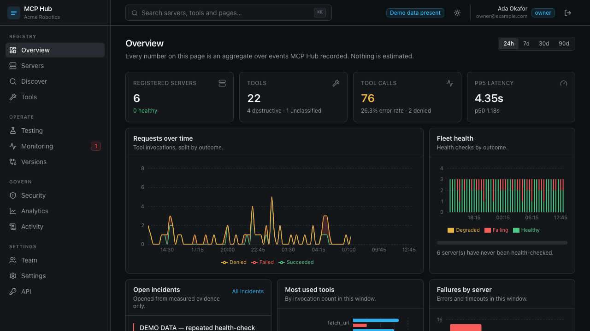
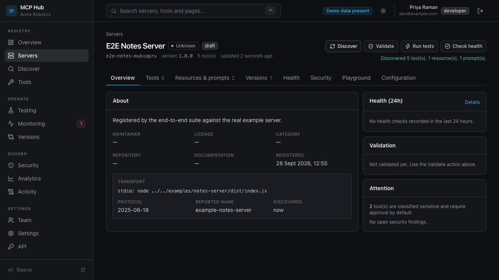
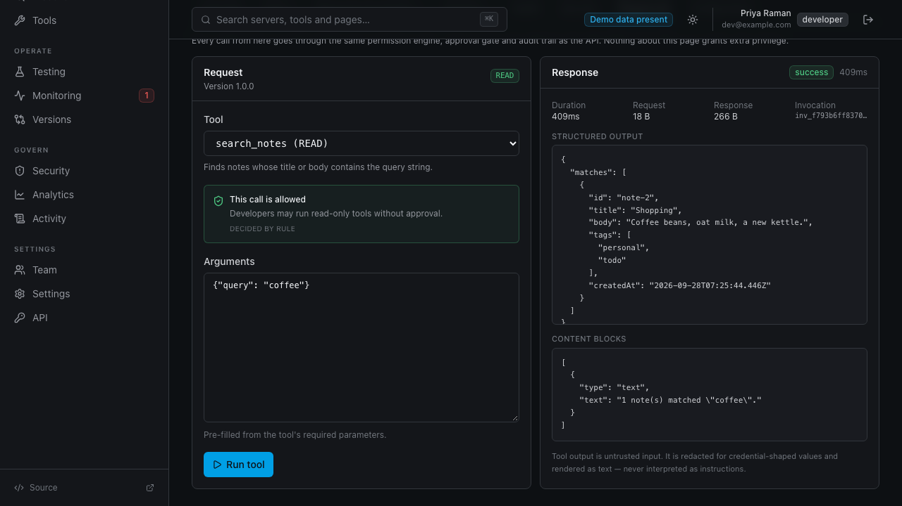
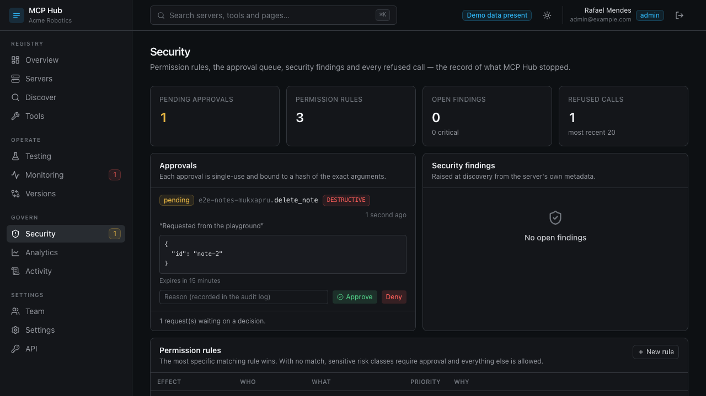
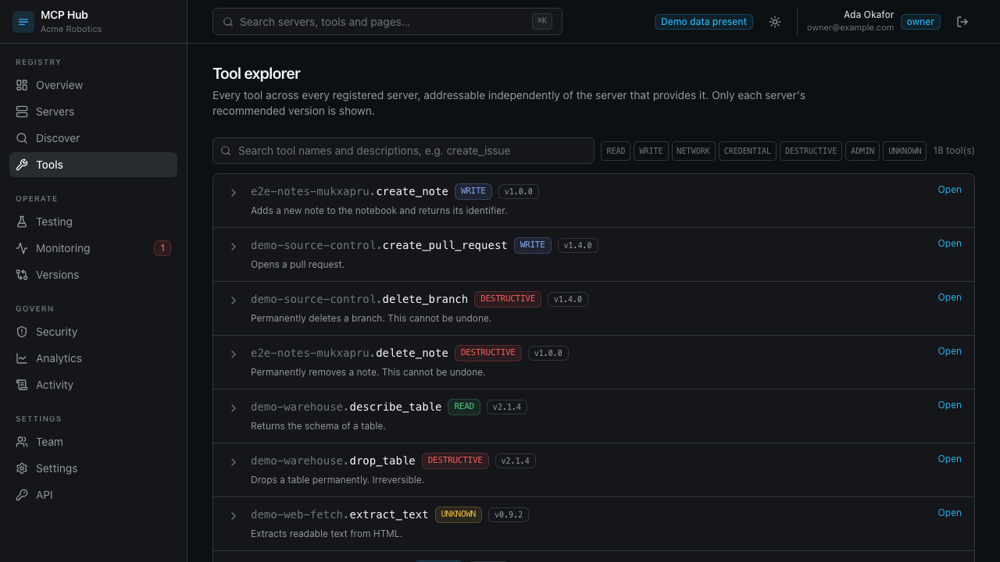
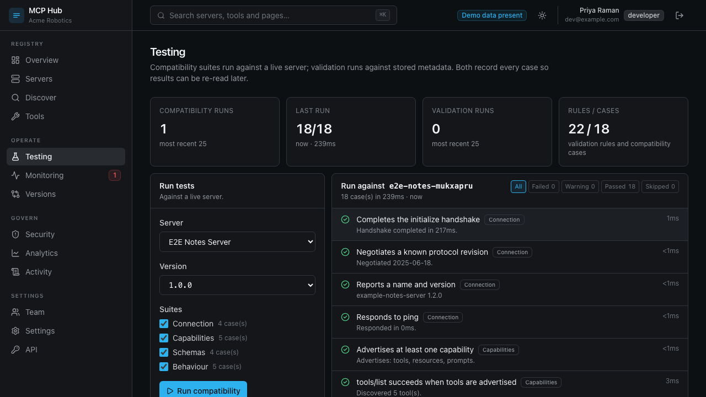

<div align="center">

# MCP Hub

**An open-source control plane for discovering, validating, testing, monitoring and governing Model Context Protocol servers.**

[](https://github.com/itsshreyasbhardwaj-design/mcp-hub/actions/workflows/ci.yml)
[](https://github.com/itsshreyasbhardwaj-design/mcp-hub/actions/workflows/security.yml)
[](LICENSE)
[](tsconfig.base.json)

[Quick start](#quick-start) · [Architecture](docs/architecture.md) · [Security](docs/security.md) · [API](docs/api.md) · [SDK](docs/sdk.md) · [MCP integration](docs/mcp-integration.md)

</div>

---

## The problem

MCP servers are easy to add and hard to govern. Once a team is running more than
a handful, some questions get uncomfortable:

- Which servers are we actually running, and what do they expose right now?
- This tool is called `delete_branch`. Who can run it, and who approved the last one?
- The vendor shipped v2. What broke?
- Which of our servers has been failing for three days without anyone noticing?
- A tool description says *"ignore previous instructions"*. Would we know?

None of these are answered by a list of MCP servers. They are answered by a
control plane that connects to each server, records what it exposes, checks
whether it works, decides who may call it, and keeps the record of what was
actually called.

That is what MCP Hub is.

## What it does

```
Discover → Register → Validate → Test → Publish → Deploy → Monitor → Version → Govern
```

| | |
| --- | --- |
| **Registry** | Register servers and versions. Registration records metadata; it never connects. |
| **Discovery** | Connect over real MCP, record every tool, resource and prompt, classify each tool's risk, scan all text for injection. |
| **Validation** | 22 rules over metadata, transports, capability consistency and tool schemas — each with a stable id, a location and a suggested fix. |
| **Compatibility** | 18 cases run against a live server. All read-only or deliberately invalid, so a run is safe against production. |
| **Playground** | Execute a tool through the real protocol, with the permission decision shown *before* you commit. |
| **Permissions** | Rules resolved by specificity across user, role, server, version, tool, risk and environment. |
| **Approvals** | Bound to a hash of the exact arguments, single-use, expiring, never self-approvable. |
| **Monitoring** | Scheduled health checks, and incidents that carry the measurements that opened them. |
| **Versioning** | Structured diffs where every change cites the rule that made it breaking — or not. |
| **Analytics** | Computed entirely from stored events. No data means an empty state, not a plausible line. |
| **Audit** | Every meaningful action, including the ones that were refused. |
| **Interfaces** | REST API, typed SDK, and MCP Hub itself exposed over MCP. |

## Quick start

```bash
git clone https://github.com/itsshreyasbhardwaj-design/mcp-hub.git
cd mcp-hub

pnpm install
cp .env.example .env.local
pnpm build
pnpm db:seed
pnpm dev
```

Open http://localhost:3000 and sign in as `owner@example.com`.

**No Docker. No database server. No accounts. No API keys.**

With no `DATABASE_URL`, MCP Hub boots [PGlite](https://pglite.dev) — PostgreSQL
compiled to WebAssembly, running in-process. It is real PostgreSQL, so the same
migrations and the same queries run in development, in the test suite and in
production. Set `DATABASE_URL` and nothing else changes.

### Try the whole thing in two minutes

The seed registers the example MCP servers in `examples/` as real, runnable
servers. So:

1. **Servers → Notes (local example) → Discover.** It connects over stdio and
   records five tools with their schemas and risk classifications.
2. **Playground → `search_notes` → Run.** A real MCP round trip, with timing,
   structured output and an invocation recorded.
3. **Playground → `delete_note`.** Classified `DESTRUCTIVE`. The run button is
   disabled until you acknowledge the risk, and then the server still refuses:
   it needs an approval bound to those exact arguments.
4. **Security → Approvals.** Sign in as `admin@example.com` and approve it.
   Now it runs — once. Try it again and it is refused.
5. **Activity.** Every step is there, with the actor and the request id.

## Screenshots

<table>
<tr>
<td width="50%"><br><sub><b>Overview.</b> Every number is an aggregate over recorded events.</sub></td>
<td width="50%"><br><sub><b>Server detail.</b> Discovery reads the live capability surface.</sub></td>
</tr>
<tr>
<td><br><sub><b>Playground.</b> The permission decision is shown before you run anything.</sub></td>
<td><br><sub><b>Security.</b> Approvals, rules, findings, and what was refused.</sub></td>
</tr>
<tr>
<td><br><sub><b>Tool explorer.</b> Tools addressed independently of their server.</sub></td>
<td><br><sub><b>Testing.</b> Every case keeps the evidence it collected.</sub></td>
</tr>
</table>

<sub>These are produced by the end-to-end suite, so they cannot drift from what the product renders.</sub>

## Architecture

```
┌─────────────────────────────────────────────────────────────────────┐
│ apps/web (Next.js)          apps/api (node:http)     apps/worker    │
│ dashboard + /api/v1/*       /api/v1/* only           jobs           │
└───────────────┬─────────────────────┬──────────────────────┬────────┘
                └─────────────────────┴──────────────────────┘
                                      │
                        ┌─────────────▼──────────────┐
                        │ @mcp-hub/api               │
                        │ router · auth · services   │
                        └─────────────┬──────────────┘
                                      │
   ┌──────────┬──────────┬────────────┼────────────┬──────────┬────────┐
   │ validator│versioning│ permissions│  testing   │  search  │assistant│
   └──────────┴──────────┴────────────┴────────────┴──────────┴────────┘
                                      │
                 ┌────────────────────┼────────────────────┐
          ┌──────▼──────┐   ┌─────────▼────────┐   ┌───────▼───────┐
          │ mcp-client  │   │    security      │   │   database    │
          │ stdio · HTTP│   │ ssrf · crypto ·  │   │ pg | PGlite   │
          │             │   │ risk · untrusted │   │ repositories  │
          └──────┬──────┘   └──────────────────┘   └───────────────┘
                 │
        ┌────────▼─────────┐
        │ third-party MCP  │   ← never trusted
        │ servers          │
        └──────────────────┘
```

Three decisions shape everything else:

**One HTTP layer, two hosts.** `@mcp-hub/api` owns routing, authentication,
authorization, rate limiting and error mapping against a framework-agnostic
request shape. The Next.js route handler and the standalone server are thin
adapters over the same route table, so they cannot drift.

**Server components take the same path.** Dashboard pages resolve a principal
exactly the way a REST request does and call the same services. There is no
looser route to the database that exists only because the caller is a React
tree.

**Every dependency has a real local implementation.** PGlite for PostgreSQL, a
dev auth provider for Clerk, a database queue for Redis, a deterministic
assistant for the model API. Each is a real implementation behind an interface,
not a stub — which is why the whole product runs, and is tested, with an empty
environment.

More in [docs/architecture.md](docs/architecture.md).

## Security

MCP Hub connects to servers other people wrote, on endpoints its users supply,
and shows the results to a model. It assumes **every MCP server is hostile**.

- **SSRF** — DNS is resolved and every address checked against private,
  loopback, link-local, CGNAT and metadata ranges; ports and schemes are
  denylisted; **every redirect hop is re-validated**, which is what defeats DNS
  rebinding.
- **Process execution** — stdio transports are off by default. When enabled the
  executable must be allowlisted, arguments are screened for shell
  metacharacters, and the child gets only `PATH`, `HOME` and the variables the
  version declared — never the Hub's own environment.
- **Prompt injection** — every string a server sends is scanned for
  instruction-override, exfiltration, tool-coercion, hidden characters and
  encoded payloads. Anything entering an LLM context is wrapped in a
  nonce-tagged fence. MCP Hub never acts on instructions found in server content.
- **Credentials** — AES-256-GCM at rest, decrypted only inside the execution
  path, never in an API response, never in a log, and emitted as `${PLACEHOLDER}`
  in generated configuration.
- **Tenant isolation** — `organization_id` is in every organization-scoped query,
  in SQL. Cross-tenant requests return `NOT_FOUND`, because confirming existence
  is itself a disclosure.
- **Four independent gates** before any tool runs: scope, permission rules,
  a sensitive-tool acknowledgement, and an argument-bound single-use approval.

61 of the 399 tests are adversarial security tests, written from the attacker's
side: cross-tenant reads, IDOR, SSRF to loopback and cloud metadata, privilege
escalation by role and by scope, approval replay and argument substitution,
secret leakage, and payload exhaustion. A further 52 cover secret redaction and
the boot-time refusal to run unsafely configured.

Full threat model, controls and **known limitations** in
[docs/security.md](docs/security.md).

## Using it

### REST API

```bash
curl -X POST "$HUB/api/v1/tools/preview" \
  -H "authorization: Bearer $MCP_HUB_API_KEY" \
  -H 'content-type: application/json' \
  -d '{"versionId":"ver_...","toolName":"delete_branch"}'
```

```json
{
  "riskClass": "DESTRUCTIVE",
  "decision": {
    "effect": "require_approval",
    "reason": "Destructive tools always require a second person to approve.",
    "source": "rule"
  },
  "requiresAcknowledgement": true
}
```

### TypeScript SDK

```ts
import { MCPHub } from '@mcp-hub/sdk';

const hub = new MCPHub({ apiKey: process.env.MCP_HUB_API_KEY! });

for await (const server of hub.paginate((cursor) => hub.servers.list({ cursor }))) {
  console.log(server.slug, server.healthStatus);
}

const diff = await hub.versions.compare(fromVersionId, toVersionId);
console.log(`${diff.breakingChanges} breaking change(s)`);
```

Reads retry with backoff. **Tool execution never retries** — replaying a
destructive call is worse than failing one.

### Through MCP

MCP Hub exposes itself as an MCP server, so an agent can ask the registry what
exists before deciding what to call:

```json
{
  "mcpServers": {
    "mcp-hub": {
      "command": "npx",
      "args": ["-y", "@mcp-hub/mcp-server"],
      "env": { "MCP_HUB_API_KEY": "${MCP_HUB_API_KEY}" }
    }
  }
}
```

All eight tools are read-only. There is no `execute_tool`, no
`register_server`, no `delete_server` — not disabled, *absent*. An agent that
reads a hostile tool description cannot be talked into using a capability that
is not in the session.

## Testing

```bash
pnpm test        # 376 unit and integration tests
pnpm test:e2e    # 23 Playwright tests
```

Neither needs a database, a broker or a network.

The suites deliberately do not mock the thing under test. The database tests run
against real PostgreSQL. The protocol tests spawn real MCP servers and speak
real JSON-RPC. The API tests drive the real router. The E2E tests build the app,
seed a throwaway database, and drive a real browser.

That caught bugs types could not: a `Date` passed as an untyped parameter that
PostgreSQL inferred as `interval`, silently breaking health scheduling; a log
redactor so eager it redacted a *count*; a playground that told a viewer
"nothing to run yet" instead of "your role cannot execute tools".

More in [docs/testing.md](docs/testing.md).

## Configuration

Every variable is optional. With an empty `.env.local` everything runs locally.

| Variable | Default | |
| --- | --- | --- |
| `DATABASE_URL` | embedded PGlite | Any PostgreSQL 14+ |
| `MCP_HUB_AUTH_PROVIDER` | `dev` | `dev` or `clerk` |
| `MCP_HUB_ENCRYPTION_KEY` | generated for dev | **Required** in production |
| `MCP_HUB_ALLOW_STDIO` | `false` | Process execution. Keep off when multi-tenant |
| `MCP_HUB_ALLOW_PRIVATE_NETWORK` | `false` | Disables part of the SSRF guard |
| `MCP_HUB_LLM_PROVIDER` | `grounded` | `grounded` calls no model at all |
| `REDIS_URL`, `TRIGGER_SECRET_KEY` | — | Reserved; the queue is PostgreSQL today |

All of them documented in [.env.example](.env.example), validated at boot, and
shown live on the Settings page. See
[docs/self-hosting.md](docs/self-hosting.md) for deployment.

## Documentation

| | |
| --- | --- |
| [Architecture](docs/architecture.md) | Layers, boundaries, and why they fall there |
| [Security](docs/security.md) | Threat model, controls, known limitations |
| [Permissions](docs/permissions.md) | Risk classes, rule resolution, approvals |
| [API](docs/api.md) | Endpoints, errors, pagination, rate limits |
| [SDK](docs/sdk.md) | Resources, errors, retry policy |
| [MCP integration](docs/mcp-integration.md) | Querying MCP Hub through MCP |
| [Search](docs/search.md) | Four strategies, weighting, the provider seam |
| [Development](docs/development.md) | Layout, commands, conventions |
| [Testing](docs/testing.md) | What runs where, and why nothing is mocked |
| [Self-hosting](docs/self-hosting.md) | Production configuration and scaling |

## Status and limitations

v0.1.0. It works, it is tested, and it is honest about its edges:

- **Risk classification is a heuristic.** It reads names, descriptions and
  schemas; a server can name a tool `read_file` and delete the filesystem. It
  exists so reviewers know what to look at first. Overrides are recorded with
  the original verdict, the reviewer and the reason.
- **Injection detection is pattern-based** and will miss novel phrasings.
  Containment — fencing, and never acting on server content — is the control
  that does not depend on detection.
- **Rate limiting is per-process.** Multi-instance deployments should supply a
  shared store through the existing interface.
- **The queue is PostgreSQL.** `REDIS_URL` and `TRIGGER_SECRET_KEY` are reserved
  in the configuration; the database queue is what ships and what is tested.
  Claiming Redis support without an implementation would be a lie in a config file.
- **Legacy HTTP+SSE transport is not implemented.** stdio and Streamable HTTP
  are. The transport layer is the extension point.

## Contributing

[CONTRIBUTING.md](CONTRIBUTING.md). The rules that matter: strict TypeScript, no
business logic in route handlers, every organization-scoped query takes
`organization_id`, server content is untrusted, and never fabricate a number.

Security issues: [SECURITY.md](SECURITY.md). Please do not open a public issue.

## License

MIT — see [LICENSE](LICENSE).
